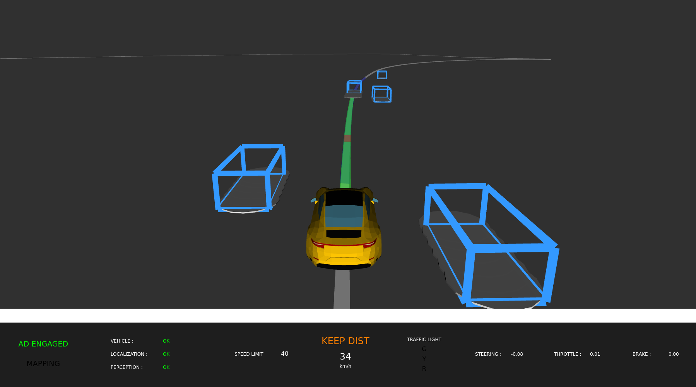
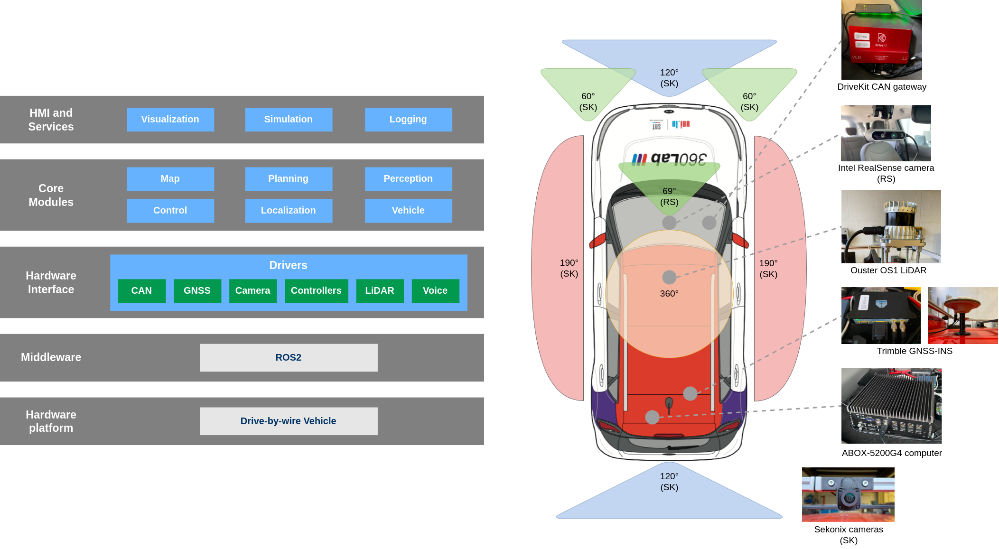

# RoboCar
RoboCar is a modular, low footprint and easy to deploy autonomous driving software based on ROS2.<br>



### Software and Hardware Overview


## Get Started

### Prerequisites
The provided Dockerfile can be used to get a development environment easily.<br>
Use `docker build -f docker/Dockerfile -t ubix/robocar .` and then run with `bash docker/run.sh`. If your system does not support the `--gpus all` option, run with `bash docker/run.sh --igpu`.<br>
Please note that some specific adjustments might be needed for deployment in a vehicle.

### Configuration
Internal RoboCar nodes (components) are configured using a custom [`robocar.json`](./src/robocar/config/robocar.json) file. Below is an example configuration:

```json
{
  "robocar": {
    "global": {
      "launch_group": "default",
      "param_a": 50,
      "param_b": "b"
    },
    "component_a": {
      "groups": ["default", "sim"],
      "param_a": 10,
      "param_c": 0.25,
      "other_params": "..."
    },
    "component_b": {
      "groups": ["sim"],
      "param_d": 0.5,
      "other_params": "..."
    },
    "component_c": {
      "groups": [],
      "other_params": "..."
    }
  }
}
```

The configuration file is structured around components (ROS2 nodes) sections and a global parameters section. The component section name must match a registered RoboCar component, see [`src/robocar/src/main.cc`](./src/robocar/src/main.cc) for how to register components. A component section contains parameters and a mandatory `"groups"` option which sets the launch groups a component belongs to. Parameters defined in the `"global"` section can be overridden in a component section, see `"param_a"` in the above example.<br>
The launch group to use must be specified in the `"global"` section under the `"launch_group"` option, in the above example, only `component_a` will be loaded whereas if launch group `"sim"` is used, both `component_a` and `component_b` are loaded.

External ROS2 nodes should be added and configured using [`robocar.launch.py`](./src/robocar/launch/robocar.launch.py).

### Build
* Debug : `bash scripts/build.sh debug`.<br>
* Release : `bash scripts/build.sh release`.

### Run
First, source using `source install/setup.sh`.<br>
RoboCar can be run using ROS2 launch : `ros2 launch robocar robocar.launch.py`.

Once RoboCar is running, pressing `SHIFT` will toggle autonomous driving (AD) mode, other basic commands can be found in the [`dashboard_component`](./src/robocar/include/robocar/visualization/dashboard_component.h).
Safety checks are implemented in the [`vehicle_component`](./src/robocar/src/vehicle/vehicle_component.cc) and they can prevent AD mode from engaging, refer to parameters and implementation to disable these checks.

## Citation
If you find RoboCar useful or relevant for your research, please cite our paper:
```bibtex
@article{testouri2024robocar,
  title={RoboCar: A Rapidly Deployable Open-Source Platform for Autonomous Driving Research},
  author={Mehdi Testouri and Gamal Elghazaly and Raphael Frank},
  year={2024},
  eprint={2405.03572},
  archivePrefix={arXiv},
  primaryClass={cs.RO}
}
```

## License
See [NOTICE](./NOTICE.txt) and [LICENSE](./LICENSE.txt).
